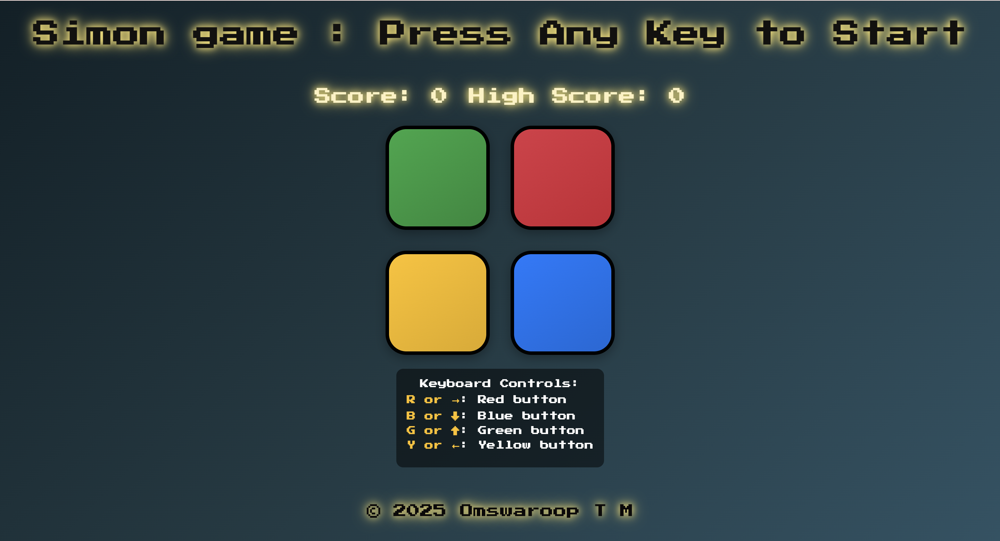

# 🎮 Simon Game

A modern implementation of the classic Simon memory game with retro aesthetics and responsive design.

 

## 🎯 Demo

Check out the live demo : https://omryuo.github.io/Simon-game/

## 🚀 Features
* Visually appealing and responsive user interface.
* Four distinct colored buttons: Green, Red, Yellow, and Blue.
* Randomly generated increasing sequence of colors.
* Clear indication of the computer's turn and the player's turn.
* Sound feedback for each button press.
* Scoring system to track your current level/score.
* High score tracking (local to the browser session).
* Keyboard controls for an alternative input method.
* Touch input support for mobile devices.
* Game over state with a clear indication to restart.
* Informative instructions for keyboard controls.
  
## 🛠️ Installation
1. Clone the repository:
<pre><code>git clone https://github.com/Omryuo/simon-game.git</code></pre>

2. Navigate to project directory:
<pre><code>cd simon-game</code></pre>

3. Open index.html in your browser

## 🕹️ How to Play
- Start Game: Press any key or tap screen
- Repeat the color sequence shown by the computer
- Progress through levels by correctly repeating patterns
- Score increases with each successful round
- High Score tracks your best performance

## ⌨️ Controls
<table>
  <tr>
    <th>Key</th>
    <th>Action</th>
  </tr>
  <tr>
    <th>R / →</th>
    <th>Red Button</th>
  </tr>
   <tr>
    <th>B / ↓</th>
    <th>Blue Button</th>
  </tr>
   <tr>
    <th>G / ↑</th>
    <th>Green Button</th>
  </tr>
   <tr>
    <th>Y / ←</th>
    <th>Yellow Button</th>
  </tr>
  <tr>
    <th>Any Key</th>
    <th>Start/Restart</th>
  </tr>	
</table>

## 📱 Mobile Support
- Fully responsive design
- Touch-optimized buttons
- Mobile-first media queries
- Works on all modern mobile browsers

## 🛠️ Technologies used :
- HTML5
- CSS3 with Flexbox
- Vanilla JavaScript (no frameworks)
- Responsive design principles

## 📂 File Structure
<pre>
simon-game/
├── index.html
├── styles.css
├── game.js
└── sounds/
    ├── red.mp3
    ├── blue.mp3
    ├── green.mp3
    ├── yellow.mp3
    └── wrong.mp3
</pre>

## 📝 Notes
- Add sound files to /sounds directory for full audio experience

- High scores are session-based (reset on page reload)

- Compatible with modern browsers (Chrome, Firefox, Safari)

## 📄 License
This project is licensed under the MIT License - see the LICENSE file for details.

## 🙏 Acknowledgements

- Inspired by the classic Simon electronic game by Milton Bradley , but project idea inspired by Dr.Angela Yu's Full stack Web development course from udemy.

- Font: "Press Start 2P" from Google Fonts
  
- Sounds adapted for nostalgic feedback

---

© 2025 Omswaroop T M
